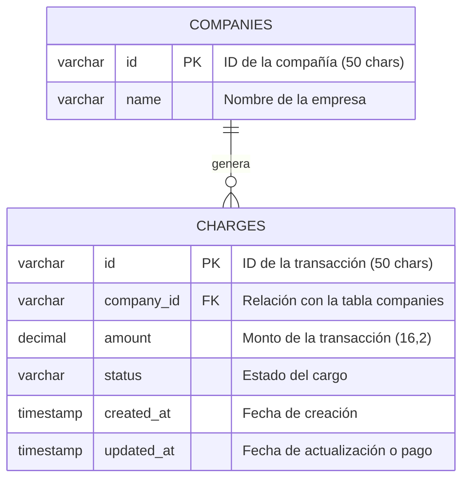

# Prueba Técnica Jorge Alberto Lopez Ronzon

Este repositorio contiene la solución a la prueba técnica dividida en dos grandes secciones: un pipeline **ETL robusto** para el procesamiento de transacciones financieras y una **API/CLI** para la resolución de un acertijo lógico-matemático.

> **Nota de Seguridad sobre el archivo `.env**`:
> Para facilitar la clonación, revisión y ejecución directa de esta prueba mediante `docker-compose up`, se ha incluido el archivo `.env` con las credenciales locales de la base de datos y el archivo `data_prueba_tecnica.csv` con los datos para su posterior extraccion. Reconozco plenamente que en un entorno real, **este archivo jamás debe ser versionado** por motivos de ciberseguridady deberian de ser agregados al archivo .gitignore.

---

## Requisitos Previos

1.
**Docker & Docker Compose**: Instalados en el sistema.

2.
**Dataset**: Debes colocar el archivo `data_prueba_técnica.csv` dentro de la carpeta `/data` en la raíz del proyecto o colocar otro archivo con el mismo nombre para realizar pruebas con diferentes datos.

---

## Instalación y Ejecución

Para levantar el ecosistema completo ejecuta:

```bash
docker-compose up --build

```

---

## Ejercicio 1: Procesamiento de Datos (ETL)

Se implementó un pipeline que extrae datos de un CSV, aplica validaciones de calidad, valida contra un esquema Avro y carga la información en una base de datos relacional.

### Reglas de Calidad y Transformación

El script `extract.py` actúa como un verificador de datos, aplicando las siguientes reglas:

* **[ERR-001/004]**: Eliminación de registros con IDs o fechas de creación nulas.
* **[ERR-002]**: Control de duplicados para proteger la integridad de la Primary Key.
* **[ERR-005]**: Limpieza de estatus corruptos (ej. `0xFFFF`).
* **[ERR-008]**: Filtro de montos exorbitantes para evitar desbordamientos numéricos (`Numeric Overflow`).
* **[ERR-009]**: Detección de IDs enmascarados o con asteriscos para asegurar la trazabilidad.

Estas fueron las reglas de negocio analizadas durante la realización del ejercicio, reconozco que pueden existir mas y se pueden integrar o retirar del modulo sin problemas.

### Decisiones de Arquitectura

* **PostgreSQL**: Elegida por su robustez transaccional (se guarda todo perfecto o no se guarda nada, evitando datos a medias) y porque cumple con ACID, que es el estándar para asegurar que la información financiera sea precisa y nunca se corrompa.
* **Formato Avro**: Usé Avro como paso intermedio para validar que los datos cumplan con el esquema exacto antes de tocar la base de datos.
* **Ajuste de IDs**: El requerimiento solicitaba `VARCHAR(24)`, pero al detectar hashes de 40 caracteres en el CSV, se optó por ampliar a `VARCHAR(50)` para evitar pérdida de información crítica y colisiones.

### Diagrama de Base de Datos 

Este es el modelo relacional implementado para asegurar la integridad y dispersión de la información entre las entidades de compañías y transacciones:



### Verificación

1. **Revisar logs**: `docker logs etl_runner`.

**Consultar Vista SQL**: Verifica el monto total diario por compañía:

```bash
docker exec -it etl_postgres psql -U admin -d tech_test_db -c "SELECT * FROM vw_daily_transactions LIMIT 10;"

```
Nota: Tambien se pueden observar los resultados mediante el motor de bases de datos de su preferencia

---

## Ejercicio 2: API del Número Faltante

Se desarrolló una aplicación en Python que identifica el número extraído de un conjunto del 1 al 100.

### Algoritmo y Clase

Se implementó la clase `NumberSet` con una lógica basada en la **Suma de Gauss**. En lugar de iterar, se calcula la diferencia entre la suma esperada (5050) y la suma actual del conjunto.

### Verificación

* **Modo CLI (Argumento)**: Como pide el requerimiento:

```bash
docker exec -it missing_number_api python api/main.py 42

```

* **Modo API Web**: Accede a la documentación interactiva en `http://localhost:8000/docs` para probar los endpoints de extracción y cálculo visualmente.

---

## Estructura del Proyecto

```text
├── api/              # Lógica de la Sección 2 (FastAPI & CLI)
├── data/             # Carpeta para el dataset original 
├── db/               # Scripts de inicialización SQL y Vista
├── etl/              # Scripts de Extracción (extract.py) y Carga (load.py)
├── logs/             # Logs estructurados del proceso
├── docker-compose.yml # Orquestación de servicios
├── .env # Archivo de credenciales y nivel de log
└── Dockerfile        # Imagen base de Python para ETL y API

```
